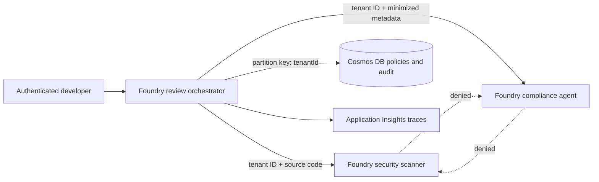

---
lab:
  title: 'Aplicar zero trust a um fluxo de trabalho multiagente do Microsoft Foundry'
  description: 'Proteja um grafo de agentes de revisão de código do Foundry com acesso escopado por identidade, propagação de tenant, prevenção de movimento lateral, minimização de dados e evidências de conformidade.'
  duration: 45
  level: 400
  islab: true
  status: 'released'
layout: default
---

# Aplicar zero trust a um fluxo de trabalho multiagente do Microsoft Foundry

## Cenário do cliente

O serviço de revisão de código da Fabrikam usa três agentes do Microsoft Foundry: um orquestrador de revisão, um scanner de segurança e um agente de conformidade. O orquestrador pode chamar qualquer um dos especialistas. Os especialistas não podem chamar uns aos outros, cada repasse deve preservar o contexto de tenant verificado e o agente de conformidade deve receber metadados em vez do código-fonte proprietário.

A implementação ao vivo cria um OpenAI client para cada agente com `get_openai_client(agent_name=...)`. Cada resposta, portanto, usa o endpoint dedicado desse agente em vez de um cliente de projeto compartilhado com `extra_body.agent_reference`.

## Cenário do laboratório

Você implantará um projeto Foundry, um modelo, contêineres do Azure Cosmos DB particionados por tenant e rastreamento do Foundry. Você testará a allowlist de chamadas entre agentes, a fronteira de tenant, as decisões de fluxo de autenticação, a minimização de dados, o isolamento de partições, atribuições de função com privilégio mínimo e evidência de conformidade. A execução ao vivo cria e invoca os três agentes no Foundry.

O Foundry hospeda os agentes; não são necessários conhecimentos de Docker ou plataformas de contêiner. O Cosmos DB fornece a fronteira de dados particionada por tenant.

Ao final deste exercício, você será capaz de:

- Aplicar identidade de agente do Foundry e RBAC do Cosmos DB escopado por contêiner sem chaves de conta.
- Selecionar managed identity, OBO, OAuth2 com PKCE ou fallback para Key Vault para uma dada operação.
- Permitir apenas arestas aprovadas em um grafo de agentes e negar movimento lateral entre especialistas.
- Propagar e aplicar o contexto de tenant antes de uma chamada de agente ou acesso a dados.
- Minimizar os dados para cada especialista e gravar evidência de auditoria escopada por tenant.
- Distinguir controles executados nesta topologia de sala de aula dos controles exigidos em produção.

> **Importante:** chamadas de modelo do Foundry, Cosmos DB e Application Insights são cobradas. Use apenas os dados sintéticos fornecidos e execute `azd down --purge` após a validação.

## Tarefa 1: Preparar o laboratório

**Revisar a arquitetura**



> **Importante - confiança residual na rede:** o template Bicep habilita acesso nativo pela rede pública para Foundry e Cosmos DB para que o cliente Python local possa alcançar ambos os endpoints do plano de dados. A autenticação Microsoft Entra, chaves locais desativadas, verificações de tenant e RBAC escopado reduzem o risco de identidade e autorização, mas não eliminam a confiança no caminho de rede pública.

Você precisa de:

- Uma assinatura do Azure e um resource group atribuído onde você pode implantar os recursos do laboratório. Você não precisa de permissões de gerenciamento de função em nível de tenant ou assinatura.
- [Python 3.10 or later](https://www.python.org/downloads/).
- [Git](https://git-scm.com/downloads).
- [Azure CLI](https://learn.microsoft.com/cli/azure/install-azure-cli).
- [Azure Developer CLI](https://learn.microsoft.com/azure/developer/azure-developer-cli/install-azd).
- [Visual Studio Code](https://code.visualstudio.com/download).
- A extensão VS Code [Python extension](https://marketplace.visualstudio.com/items?itemName=ms-python.python).
- A extensão VS Code [Bicep extension](https://marketplace.visualstudio.com/items?itemName=ms-azuretools.vscode-bicep).

1. Se ainda não fez, clone o [repositório de origem do laboratório](https://github.com/MicrosoftLearning/mslearn-ai-multi-agents/tree/main), ou faça um fork do repositório e clone seu fork:

```console
git clone https://github.com/MicrosoftLearning/mslearn-ai-multi-agents.git
```

2. Abra o repositório clonado no Visual Studio Code.
3. Mude para o diretório starter.
4. Valide as ferramentas requeridas a partir do terminal do VS Code:

```powershell
cd Allfiles\10-fabrikam-zero-trust-security
az version
azd version
python --version
```

5. Faça login com Azure CLI e Azure Developer CLI.
6. Confirme a assinatura que você pretende usar:

```powershell
az login
az account show --output table
azd auth login
```

7. Use apenas os dados sintéticos fornecidos.
8. Não adicione chaves, connection strings, tokens ou código-fonte do cliente aos arquivos iniciais.

## Tarefa 2: Montar o ambiente virtual

1. No Windows, crie e ative um ambiente Python isolado:

```powershell
./scripts/setup.ps1
. ./.venv/Scripts/Activate.ps1
```

> No macOS/Linux, execute `bash scripts/setup.sh` e `source .venv/bin/activate` em vez disso.

## Tarefa 3: Aplicar repasses de agentes cientes do tenant

Implemente a correspondência de tenant e teste-a junto com a allowlist de chamadas entre agentes e a minimização de payload fornecidas.

Cada placeholder marca código incompleto. Copie cada trecho fornecido para o local do placeholder, mantenha o comentário `LAB PLACEHOLDER`, substitua apenas a linha ou bloco incompleto indicado, e preserve a indentação ao redor.

Os valores sintéticos `verifiedCaller` representam claims já autenticados em uma fronteira de API por meio de verificações de assinatura do token, issuer, audience e expiry. Seu código autoriza as ações desse chamador. Nunca autorize uma requisição de produção a partir de um payload JWT não verificado.

**Revisar a política de repasse**

1. Antes de editar o código, abra os arquivos a seguir e trace como as quatro tentativas sintéticas de repasse são avaliadas. Você não precisa modificar esses arquivos nem registrar respostas por escrito.

- `assets/security-policy.json` define o grafo de chamadas permitidas entre agentes. Somente `review-orchestrator` pode chamar os dois especialistas.
- `assets/security-requests.json` contém quatro tentativas sintéticas de repasse.
- `src/security.py` aplica validação de tenant, autorização de grafo de chamadas, minimização de payload e seleção de fluxo de autenticação.

Para cada requisição, identifique se o tenant corresponde, se o chamador pode invocar o agente alvo e quais campos o agente alvo precisa. Você implementará a checagem de validação de tenant ausente na próxima seção; os outros controles já estão providos.

**Completar a autorização de tenant**

2. Abra `src/security.py`.
3. Localize **LAB PLACEHOLDER 1** em `enforce_tenant`.
4. Mantenha o comentário do placeholder.
5. Substitua apenas a linha `raise NotImplementedError` por:

```python
if not requested_tenant_id:
  raise PermissionError("Tenant context is required")
if requested_tenant_id != verified_tenant_id:
  raise PermissionError("Tenant context does not match the verified caller")
```

Este código falha fechado: um tenant ausente e um tenant incompatível são ambos negados antes que outro agente seja chamado.

**Validar as decisões de autorização**

6. Execute os cenários e exiba uma linha para cada repasse:

```powershell
$evidence = python -m src.main | ConvertFrom-Json
$evidence.decisions | Format-Table case, decision, target, reason
```

7. Compare as linhas com os resultados esperados:

| Caso | Resultado esperado | Motivo |
|---|---|---|
| `allowed-orchestrator-to-scanner` | `allow` | O tenant corresponde e o grafo de chamadas permite orquestrador chamar scanner. |
| `denied-cross-tenant` | `deny` com motivo de incompatibilidade de tenant | A requisição pede `tenant-b`, mas o chamador verificado pertence a `tenant-a`. |
| `denied-specialist-lateral-movement` | `deny` com motivo de chamada de agente | O tenant corresponde, mas o grafo de chamadas não permite que scanner chame o agente de conformidade. |
| `allowed-minimized-compliance-handoff` | `allow` | O tenant corresponde e o grafo de chamadas permite orquestrador chamar o agente de conformidade. |

A requisição entre tenants falha `enforce_tenant`. A requisição de movimento lateral passa na validação de tenant, mas falha na checagem do grafo de chamadas de `authorize_handoff`.

**Validar a minimização de dados**

8. Inspecione o que o repasse permitido para conformidade encaminha:

```powershell
$complianceDecision = $evidence.decisions | Where-Object case -eq 'allowed-minimized-compliance-handoff'
$complianceDecision.fieldsForwarded
```

Saída esperada:

```text
consentRecorded
dataClassification
repositoryRegion
requestId
tenantId
```

`sourceCode` não deve aparecer. O agente de conformidade precisa de classification, residency, consent, request e metadados de tenant, mas não precisa do código-fonte da Fabrikam.

**Rever a seleção de fluxo de autenticação**

O código fornecido seleciona um fluxo de autenticação; você não implementa trocas OAuth.

9. Exiba as decisões feitas por `select_authentication_flow`:

```powershell
$evidence.authenticationFlows | Format-List
```

Saída esperada:

```text
agentToAzure            : managed_identity
userToMicrosoftResource : on_behalf_of
userToThirdParty        : oauth2_pkce
legacyApi               : key_vault_fallback
```

- `managed_identity` evita credenciais armazenadas para acesso de agente a recursos do Azure.
- `on_behalf_of` preserva as permissões delegadas de um usuário para um recurso Microsoft.
- `oauth2_pkce` suporta autorização interativa de terceiros sem um client secret na aplicação.
- `key_vault_fallback` permite uma chave legada somente quando o armazenamento em Key Vault e a política de rotação de 90 dias são satisfeitas.

Estas são seleções de política determinísticas, não quatro trocas de autenticação ao vivo.

**Confirmar os controles locais**

10. Execute as verificações:

```powershell
$actualDecisions = $evidence.decisions.decision -join ','
if ($actualDecisions -ne 'allow,deny,deny,allow') {
  throw "Unexpected decisions: $actualDecisions"
}
if ($complianceDecision.fieldsForwarded -contains 'sourceCode') {
  throw 'Data minimization failed: sourceCode was sent to the compliance agent'
}
if ($evidence.authenticationFlows.agentToAzure -ne 'managed_identity' -or
    $evidence.authenticationFlows.userToMicrosoftResource -ne 'on_behalf_of' -or
    $evidence.authenticationFlows.userToThirdParty -ne 'oauth2_pkce' -or
    $evidence.authenticationFlows.legacyApi -ne 'key_vault_fallback') {
  throw 'One or more authentication-flow decisions are incorrect'
}
python scripts/preflight.py
$incomplete = Select-String -Path src/security.py -Pattern 'raise NotImplementedError'
if ($incomplete) { throw 'Task 1 is incomplete' }
'TASK_1_VALIDATION_PASSED'
```

Saída esperada: o preflight termina com `READY (local)`, seguido por `TASK_1_VALIDATION_PASSED`.

## Tarefa 4: Provisionar a topologia do Foundry

1. Defina a região para uma onde o modelo selecionado esteja disponível.
2. > **Grupo de recursos:** Se seu ambiente de laboratório fornecer um grupo de recursos pré-criado, defina `$resourceGroupName` com seu nome. Caso contrário, deixe `$resourceGroupName` vazio para que o script crie um resource group único em sua assinatura.
3. Execute os comandos a seguir:

```powershell
$azureRegion = 'eastus2'
$resourceGroupName = ''
az login
if ([string]::IsNullOrWhiteSpace($resourceGroupName)) {
  $resourceGroupName = "rg-lab10-$((New-Guid).Guid.Substring(0, 8))"
  az group create --name $resourceGroupName --location $azureRegion | Out-Null
}
$principalId = az ad signed-in-user show --query id --output tsv
$env:AZURE_DEV_USER_AGENT = 'microsoft_foundry_skill'
azd env new lab10-zero-trust
azd env set AZURE_LOCATION $azureRegion
azd env set AZURE_RESOURCE_GROUP $resourceGroupName
azd env set AZURE_PRINCIPAL_ID $principalId
azd env set FOUNDRY_MODEL_NAME gpt-5.4-mini
azd env set FOUNDRY_MODEL_CATALOG_NAME gpt-5.4-mini
azd env set FOUNDRY_MODEL_VERSION 2026-03-17
az bicep build --file infra/main.bicep
azd provision
azd env get-values | Out-File .env -Encoding utf8
Remove-Item Env:AZURE_DEV_USER_AGENT
python scripts/preflight.py
```

Saída esperada: o Bicep compila, o provisionamento é bem-sucedido e o preflight termina com `READY (local)`. O arquivo `.env` contém as coordenadas do Foundry, Cosmos DB e monitoramento, mas sem chaves, connection strings ou tokens. A implantação padrão ainda tem confiança residual na rede porque seus endpoints públicos do Foundry e do Cosmos DB estão habilitados para acesso local do laboratório.

> **Design de rede para produção:** Este laboratório não cria private endpoints, private DNS ou conectividade runtime privada. Os modos managed-network do Foundry também têm restrições em tempo de criação, então escolha e valide o modelo de acesso de produção antes de criar recursos em produção. Consulte [Configurar rede virtual gerenciada para projetos Microsoft Foundry](https://learn.microsoft.com/azure/foundry/how-to/managed-virtual-network#understand-isolation-modes).

## Tarefa 5: Revisar o design de privilégio mínimo

1. Inspecione os controles declarados e as fronteiras efetivas de rede e RBAC do plano de dados implantadas:

```powershell
Select-String -Path infra/main.bicep -Pattern 'disableLocalAuth: true'
$values = azd env get-values --output json | ConvertFrom-Json
$foundryNetwork = az cognitiveservices account show `
  --name $values.FOUNDRY_ACCOUNT_NAME `
  --resource-group $resourceGroupName `
  --query "{publicNetworkAccess:properties.publicNetworkAccess,defaultAction:properties.networkAcls.defaultAction}" | ConvertFrom-Json
$cosmosAccountName = ($values.COSMOS_ACCOUNT_ID -split '/')[-1]
$cosmosNetwork = az cosmosdb show `
  --name $cosmosAccountName `
  --resource-group $resourceGroupName `
  --query "{publicNetworkAccess:publicNetworkAccess}" | ConvertFrom-Json
$learnerDataRoles = az cosmosdb sql role assignment list `
  --account-name $cosmosAccountName `
  --resource-group $resourceGroupName | ConvertFrom-Json
$foundryNetwork
$cosmosNetwork
$learnerDataRoles | Select-Object principalId, scope
```

2. Confirme todos os seguintes limites:

- Foundry e Cosmos DB ambos definem `disableLocalAuth: true`, então aplicações não podem usar service keys.
- O Foundry reporta `publicNetworkAccess: Enabled` e `defaultAction: Allow`, e o Cosmos DB reporta `publicNetworkAccess: Enabled`. Registre isto como confiança residual na rede do sandbox, não como confiança zero na rede.
- Exatamente duas atribuições do Cosmos DB para `$principalId` terminam em `/colls/tenant-policies` e `/colls/security-audit`; nenhuma atribuição é em escopo de conta, resource group ou assinatura.
- Os IDs de principal efetivos e os escopos correspondem à identidade e aos contêineres usados pelo fluxo de trabalho ao vivo.

Se qualquer configuração ou atribuição efetiva difere do design declarado, pare e resolva a deriva da implantação antes da execução ao vivo. Não trate uma requisição autenticada bem-sucedida como prova de que o limite de rede ou RBAC é privilégio mínimo.

O recurso do projeto também tem uma managed identity. Ela autentica a blueprint de identidade do agente do projeto; não é o principal que deve receber permissões de ferramentas downstream. O Foundry cria uma identidade de agente compartilhada separada após o primeiro agente ser criado.

## Tarefa 6: Executar o fluxo de trabalho ao vivo do Foundry

1. Execute o fluxo de trabalho com três agentes e retenha sua saída estruturada:

```powershell
$liveEvidence = python -m src.main --live | ConvertFrom-Json
$liveEvidence | ConvertTo-Json -Depth 10
```

Saída esperada:

- Existem Foundry versions para `review-orchestrator`, `security-scanner` e `compliance-agent`.
- As saídas de ambos os especialistas incluem um Foundry response ID.
- O orquestrador produz uma resposta de síntese.
- `crossTenantHandoffDenied` é `true` porque o chamador verificado do tenant B não pode requisitar um repasse para tenant A. A negação ocorre antes de qualquer chamada ao Cosmos DB, modelo ou ferramenta.
- O evento de auditoria contém `tenantId`, `agentId`, `action`, `decision` e `correlationId`.

O processo Python usa seu `DefaultAzureCredential` para acesso ao Cosmos DB e acesso ao projeto Foundry durante esta execução interativa. Uma resposta `403` indica que o provisionamento não estabeleceu o acesso requerido.

2. Se você receber uma resposta `403`, reporte o erro de implantação ao instrutor.
3. Não tente criar ou inspecionar atribuições de função manualmente.

Os agentes de prompt criados por esta execução não chamam diretamente o Cosmos DB. Se um agente de produção posteriormente usar uma ferramenta MCP ou A2A para acessar o Cosmos DB, um administrador deve conceder ao `agentIdentityId` desse agente apenas o acesso ao contêiner requerido pela ferramenta. Publicar um agente cria uma identidade distinta, e permissões atribuídas à identidade de desenvolvimento compartilhada não são transferidas automaticamente.

## Tarefa 7: Inspecionar evidências de tenant e conformidade

1. Exiba os response IDs criados pela execução ao vivo:

```powershell
$liveEvidence.specialistOutputs.'security-scanner'.responseId
$liveEvidence.specialistOutputs.'compliance-agent'.responseId
$liveEvidence.orchestratorOutput.responseId
```

2. No portal do Foundry, abra o projeto identificado por `FOUNDRY_PROJECT_ENDPOINT`.
3. Abra **Agentes (Agents)** > **Rastreamentos (Traces)**.
4. Aguarde alguns minutos para ingestão dos traces, se necessário.
5. Encontre as três chamadas correspondendo aos response IDs.
6. Inspecione a entrada e a saída de cada chamada.

A execução ao vivo usa a primeira requisição fornecida, então `tenant-a` e `req-001` são os únicos identificadores de tenant e requisição esperados nesses traces.

7. Confirme que:

- Nenhum GUID de tenant real, domínio de tenant, identificador de usuário, nome de repositório ou código-fonte do cliente aparece.
- A entrada do security-scanner contém apenas o código sintético fornecido, `print('synthetic')`.
- A entrada do compliance-agent contém a requisição, tenant, região, classificação e metadados de consentimento, mas nenhum campo `sourceCode`.
- A entrada do orquestrador contém `tenant-a`, `req-001` e os resultados dos dois especialistas.

`tenant-b` não deve aparecer em um trace de agente do Foundry. A aplicação rejeita o tenant verificado incompatível antes de qualquer chamada ao agente ou ao plano de dados.

8. Inspecione as evidências de tenant e auditoria retornadas pela execução ao vivo sem abrir o Explorador de Dados (Data Explorer) do Cosmos DB:

```powershell
$liveEvidence.tenantPolicy | Format-List
$liveEvidence.auditEvent | Format-List
if ($liveEvidence.tenantPolicy.tenantId -ne 'tenant-a') { throw 'Unexpected policy tenant' }
if (-not $liveEvidence.crossTenantHandoffDenied) { throw 'Cross-tenant handoff was not denied' }
$requiredAuditFields = @('tenantId', 'agentId', 'action', 'decision', 'correlationId')
$missingAuditFields = $requiredAuditFields | Where-Object { -not $liveEvidence.auditEvent.PSObject.Properties[$_] }
if ($missingAuditFields) { throw "Audit evidence is missing: $($missingAuditFields -join ', ')" }
if ($liveEvidence.auditEvent.PSObject.Properties['sourceCode']) { throw 'Audit evidence contains source code' }
'TENANT_AND_AUDIT_EVIDENCE_VALIDATED'
```

Espere `TENANT_AND_AUDIT_EVIDENCE_VALIDATED`: a política pertence a `tenant-a`, e o evento de auditoria tem todos os campos requeridos e nenhum código-fonte. Isto verifica o comportamento do plano de dados sem enumeração de RBAC ou permissões de navegação no portal.

9. Execute novamente os cenários de segurança determinísticos após qualquer alteração de política:

```powershell
python -m src.main
```

Saída esperada: a lista de falhas de controle de produção permanece vazia e a sequência de decisão permanece `allow`, `deny`, `deny`, `allow`.

10. Trate uma alteração em qualquer resultado de cross-tenant, movimento lateral, minimização, fluxo de autenticação, contrato de rede ou esquema de auditoria como um bloqueador de release.

## Desafio opcional: Negar um repasse entre tenants

Submeta uma requisição cujo tenant solicitado difere do tenant do chamador verificado.

**Saída esperada:** O repasse é negado antes de qualquer chamada ao Cosmos DB, modelo ou ferramenta, e a evidência identifica a decisão da política de tenant.

**Investigação de falha:** Compare falhas de identidade, rede, política de tenant e partição de dados e indique qual evidência distingue cada fronteira.

## Tarefa 8: Limpeza

**Remover recursos do Azure**

1. Execute os comandos a seguir:

```powershell
$env:AZURE_DEV_USER_AGENT = 'microsoft_foundry_skill'
azd down --purge --force
Remove-Item Env:AZURE_DEV_USER_AGENT
Remove-Item .env -ErrorAction SilentlyContinue
```

**Desativar o ambiente virtual**

2. Execute este comando em todo terminal onde `(.venv)` apareça no prompt:

```powershell
deactivate
```

## Resumo

Você aplicou autorização ciente de tenant, minimizou repasses, escopou acessos e controles de auditoria a um fluxo de trabalho Foundry ao vivo, enquanto distinguiu controles implantados dos requisitos de rede e identidade em produção.
